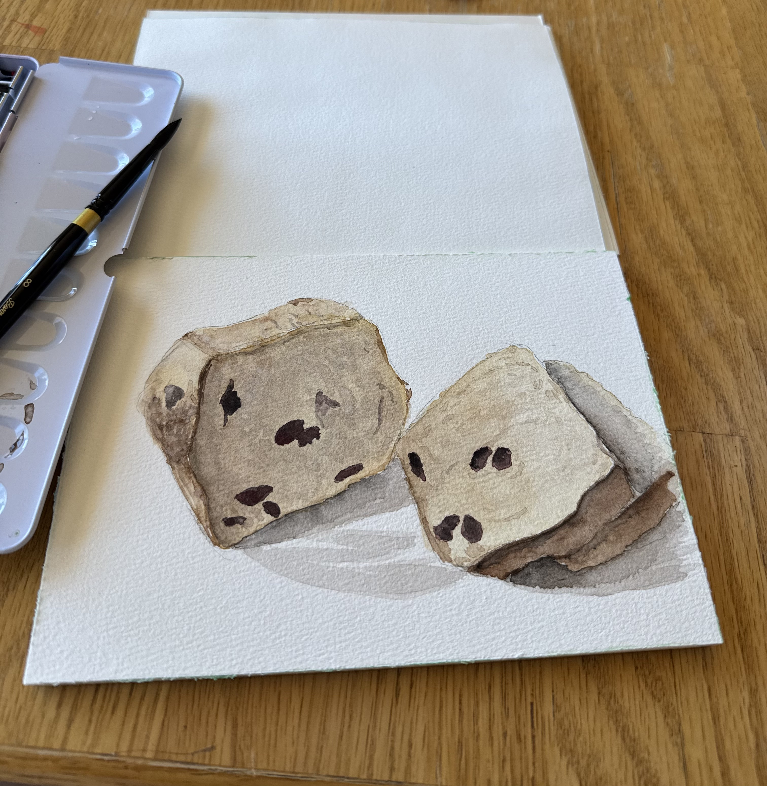
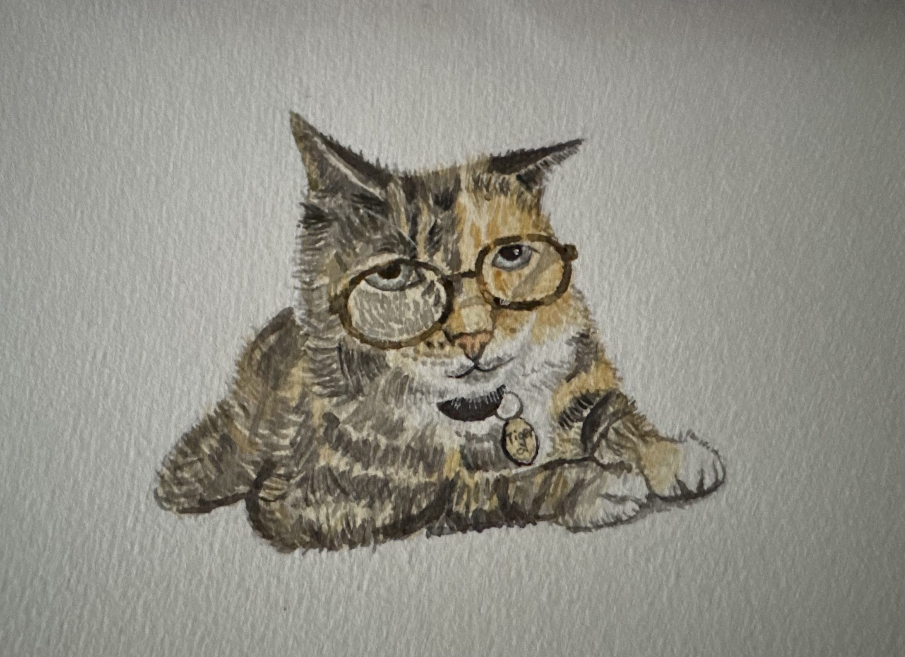

 
## Bio

I am a currently second year MHS Epidemiology student in infectious disease track. I am interested in any emerging infectious diseases, bacterial infection, and vaccine. I am from Shanxi, China. In my free time, I love watching shows and doing some watercolor paintings.

## Education

**Johns Hopkins Bloomberg School of Public Health** | Baltimore, MD

MHS in Epidemiology | August 2024 - May 2026

**Syracuse University** | Syracuse, NY

B.S. in Public Health & Neuroscience | August 2020 - May 2024

## Research Experience

**Johns Hopkins Center for Indigenous Health** | Research Assistant | June 2025 - August 2025

**Pride Center of Maryland** | Volunteer | November 2024 - Present

[**Larsen's Lab in Syracuse University**](https://www.maxwell.syr.edu/directory/david-larsen) | Research Assistant | June 2022 - May 2024

[**Aphasia Lab in Syracuse University**](https://aphasialab.syr.edu/) | Research Assistant | May 2023 - May 2024

## Publication

Raymond, S., Neyra, M., Hill, D.T. et al. How local health departments use wastewater surveillance data for public health planning and intervention in New York State. BMC Public Health 25, 2842 (2025). [Link to article](https://doi.org/10.1186/s12889-025-24250-6)

Kappus-Kron H, Chatila DA, MacLachlan AM, Pulido N, Yang N, Larsen DA. Precision public health in schools enabled by wastewater surveillance: A case study of COVID-19 in an Upstate New York middle-high school campus during the 2021-2022 academic year. PLOS Glob Public Health. 2024 Jan 10;4(1):e0001803. [Link to article](https://doi.org/10.1371/journal.pgph.0001803) 

## Skills

- 📊 **R**  
- 📊 **SAS**  
- 📝 **REDCap**  
- 💻 **Microsoft Office**  
- 🫀 [**AED & CPR**](Student_eCard.pdf) 
- 🧪 [**HIV Testing & Counseling**](HIV.pdf)

## My Paintings

Here are a few of my artworks:

{width=300px}

{width=300px}

